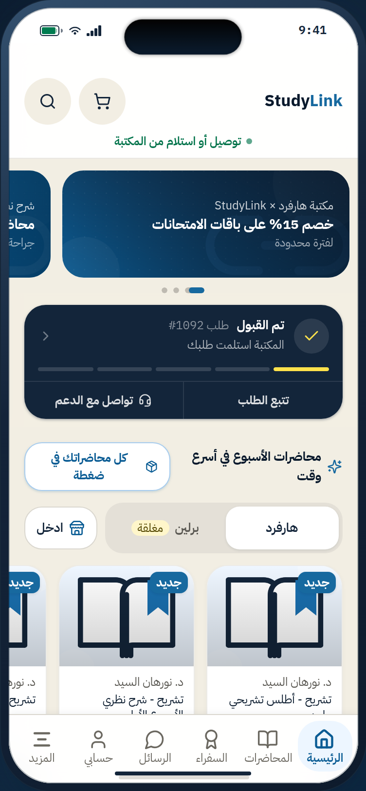
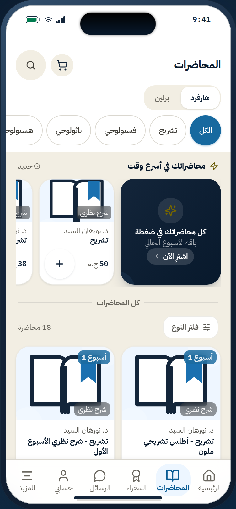
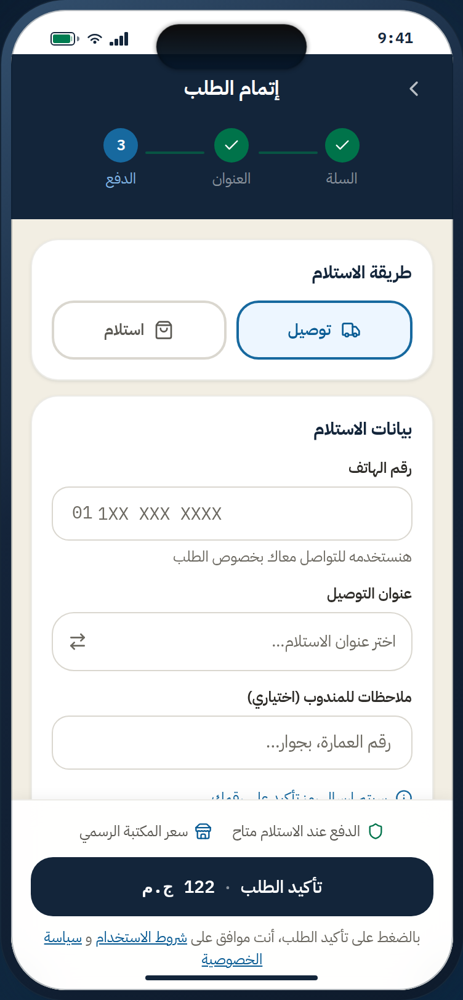
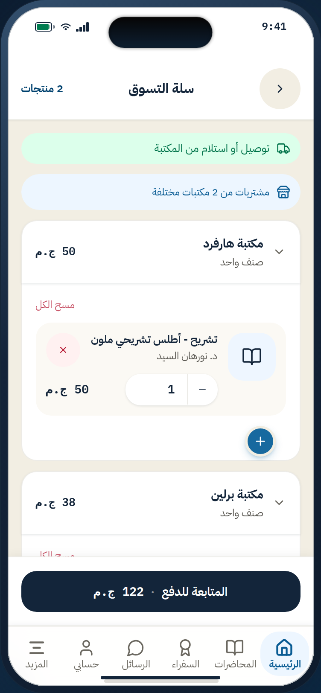
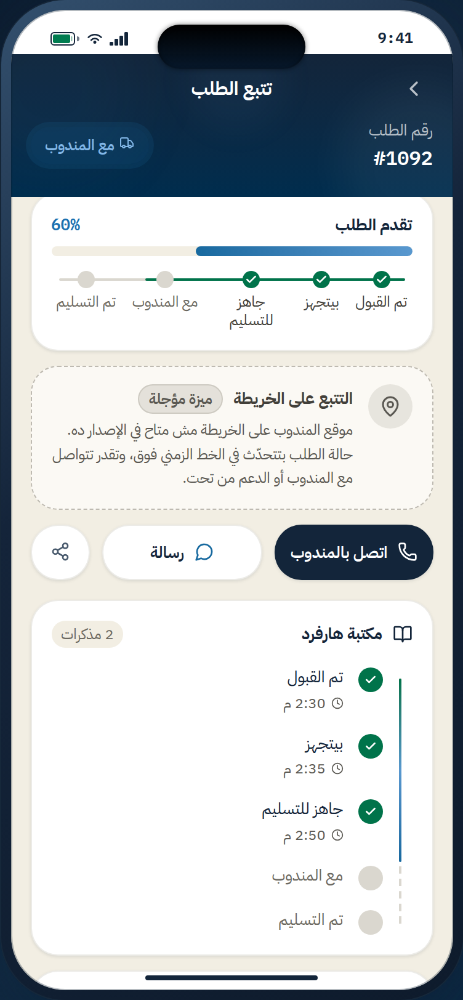
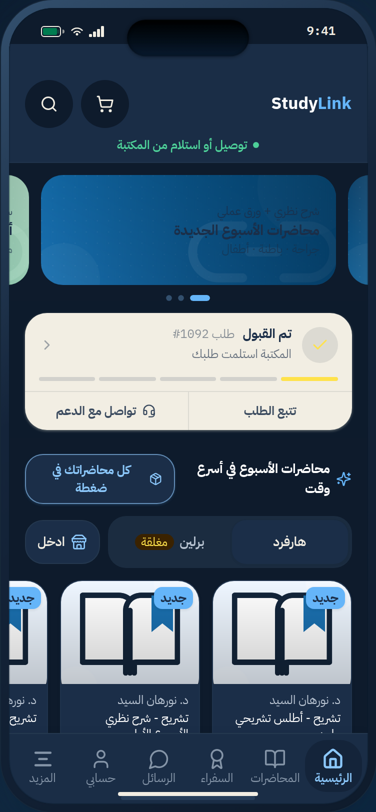

<div dir="rtl">

# StudyLink — موك اب التطبيق

معاينة تفاعلية لواجهة تطبيق **StudyLink**: سوق أكاديمي لطلبة جامعة المنصورة — مذكرات وملخصات وأدوات مكتبية وطبية، بتوصيل أو استلام من المكتبة.

٢٧ شاشة كاملة داخل إطار هاتف، بالعربية و`RTL`، مبنية على نظام الهوية الرسمي **`studylink-identity-v1`**.

<p align="center">
  
  
  
</p>
<p align="center">
  
  
  
</p>

---

## التشغيل

```bash
npm run setup        # install --include=dev + كروميوم لأدوات الفحص
npm run dev          # http://localhost:3000
```

> **بتعدّل في الكود؟** [`DEV.md`](DEV.md) فيه خريطة «عايز أغيّر كذا ← روح فين»،
> والقواعد اللي لو كسرتها هتلاقي باج غريب، وجدول أعطال شائعة.
>
> **بتبني التطبيق من الموك اب؟** افتح الصفحة واضغط **«مواصفات للمطوّر»** تحت
> إطار الهاتف: لكل شاشة غرضها ومصدر بياناتها وقواعدها والحالات المطلوبة وما هو
> **مؤجَّل لا يُبنى**. المحتوى في `src/lib/spec.ts`.

---

## البراند بوك وأصول الهوية

المرجع البصري المعتمد ([`studylink-identity-v1`](https://drive.google.com/drive/folders/1BX9YVdAvYwxu-eWqCweIvsKJKMwOcDYZ)) منشور مع الموك اب:

| | |
|---|---|
| **البراند بوك** | [`/brand/studylink-brand-book.html`](https://dramrhaleem.github.io/studylink-mockup/brand/studylink-brand-book.html) |
| **أيقونات النظام** | ٣٥ أيقونة SVG — [تنزيل](https://dramrhaleem.github.io/studylink-mockup/brand/downloads/studylink-native-icons-svg.zip) · معاينة في قسم البراند بوك بالصفحة |
| **توكنز الألوان** | [تنزيل](https://dramrhaleem.github.io/studylink-mockup/brand/downloads/studylink-color-tokens.zip) — `tokens.css` · `tokens.scss` · `palette.json` · `tokens.dtcg.json` |
| **الخطوط** | [تنزيل](https://dramrhaleem.github.io/studylink-mockup/brand/downloads/studylink-fonts.zip) — SIL OFL 1.1 |
| **حزمة الشعار** | [تنزيل](https://dramrhaleem.github.io/studylink-mockup/brand/downloads/studylink-logo-pack.zip) |
| **العربية وRTL واللغة** | [تنزيل](https://dramrhaleem.github.io/studylink-mockup/brand/downloads/studylink-verbal-arabic-rtl.zip) |
| **قوالب الطباعة** | [تنزيل](https://dramrhaleem.github.io/studylink-mockup/brand/downloads/studylink-print-templates.zip) |
| **السوشيال ومتاجر التطبيقات** | [تنزيل](https://dramrhaleem.github.io/studylink-mockup/brand/downloads/studylink-social-appstore.zip) |
| **نسخة سحابية** | [مجلد Google Drive](https://drive.google.com/drive/folders/1BX9YVdAvYwxu-eWqCweIvsKJKMwOcDYZ) |

**لا يوجد «دليل نظام تصميم» في الصفحة، وهذا مقصود:** كان قسمًا يعيد بناء النظام
يدويًا فصار نسخة ثانية تناقض المصدر مع الوقت. حلّ محله البراند بوك نفسه.
أما **متى** يُستخدم كل لون فمكانه [`DESIGN-SYSTEM-COLOR.md`](DESIGN-SYSTEM-COLOR.md).

## التنقّل بين الشاشات

كل شاشة لها رابط مباشر:

```
/?screen=home        /?screen=cart          /?screen=checkout
/?screen=lectures    /?screen=tracking      /?screen=order-success
/?screen=profile     /?screen=wallet        /?screen=ambassador
/?screen=more        /?screen=notifications /?screen=library-harvard
```

القائمة الكاملة في `src/app/page.tsx` داخل `renderSecondaryScreen`.

---

## النشر على GitHub Pages

المستودع فيه `.github/workflows/deploy.yml` يبني ويَنشر تلقائيًا على كل دفعة إلى `main`.

**مرة واحدة بعد أول دفعة:** من `Settings` ← `Pages` ← `Build and deployment` ← اختر **`GitHub Actions`** مصدرًا. مش محتاج تختار فرع.

بعدها الموقع يبقى على:

```
https://<username>.github.io/<repo-name>/
```

بادئة المسار (`basePath`) تُحسب تلقائيًا من اسم المستودع عبر `actions/configure-pages`، فالمشروع يعمل سواء نُشر في مجلد مستودع أو على `<username>.github.io` مباشرة.

### بناء النسخة الثابتة محليًا

```bash
STATIC_EXPORT=1 npm run build          # يخرج إلى ./out
npx serve out                          # أو أي خادم ملفات ثابتة
```

لمحاكاة النشر داخل مجلد مستودع:

```bash
STATIC_EXPORT=1 NEXT_PUBLIC_BASE_PATH=/studylink-mockup npm run build
```

---

## التقنية

| | |
|---|---|
| الإطار | Next.js 16 · React 19 · TypeScript |
| التنسيق | **Tailwind v4** — الإعداد كله في CSS، **لا يوجد `tailwind.config.ts`** |
| الحالة | zustand مع `persist` |
| الحركة | framer-motion |
| المكوّنات | shadcn/ui فوق Radix |
| الخطوط | StudyLink Arabic + StudyLink Mono (SIL OFL) عبر `next/font/local` |

---

## قواعد لا يجوز كسرها

هذه ليست تفضيلات — كل واحدة منها كانت خطأً حقيقيًا في نسخة سابقة.

1. **كل التوكنز في `src/app/globals.css`** داخل `@theme`. لا تكتب لونًا في شاشة.
   حتى نطاقات Tailwind القياسية (`emerald` · `violet` · `rose` …) أُعيد تعريفها
   لتشير إلى ألوان البراند، فاللوحة مغلقة ولا يمكن الخروج منها بالخطأ.
   لكن الإغلاق التقني لا يكفي — **قانون اللون الدلالي** في
   [`DESIGN-SYSTEM-COLOR.md`](DESIGN-SYSTEM-COLOR.md) ملزم بنفس القدر:
   `sky-*` هو اللهجة التفاعلية الوحيدة، وألوان الحالة للحالة فقط، ولون التصنيف
   من `src/lib/category.ts` وحده، **ولا إيموجي في الواجهة**.

2. **كل رقم مالي من `src/lib/pricing.ts`.** لا تُعِد اشتقاق أي مبلغ في شاشة.
   الرسوم كانت مكرّرة في ثلاثة ملفات وقد اختلفت فعليًا.

3. **كل رقم معروض يُلفّ في `.sl-num`.** بدونها تقلب الخوارزمية ثنائية الاتجاه
   ترتيب الرقم والعملة داخل الجملة العربية.
   ⚠️ ولا تضعها على حقل نص عربي حر — الخط لاتيني أحادي المسافة ولا يشكّل العربية.

4. **الأرقام الغربية `0-9` في كل مكان.** ممنوع `toLocaleString('ar-EG')`.

5. **ممنوع `tracking-*` على العربية.** أي `letter-spacing` موجب يفتح فجوات داخل
   الوصل ويكسر الكلمة.

6. **RTL بخصائص منطقية:** `ms-*` · `me-*` · `ps-*` · `pe-*` · `start-*` · `end-*`.
   و`translateX` خاصية **فيزيائية** لا منطقية — في RTL الإزاحة للأمام سالبة.

7. **أي أصل من `public/` يمرّ عبر `asset()`** من `src/lib/asset.ts`. المسار
   المطلق لا يحترم `basePath`، فتسقط كل الصور بصمت بعد النشر.

8. **الحد الأدنى للنص:** 12px لعناصر الواجهة و13px للمتن.

9. **الاسم المعروض `StudyLink` باللاتينية دائمًا.** «ستادي لينك» مرفوضة
   («ستاد» = الملعب).

10. **لا وعد بلا دليل:** ممنوع زمن توصيل ثابت، أو «مضمون»، أو «أصلي 100%»،
    أو أي عدد مستخدمين/طلبات غير مولّد من النظام.

---

## أدوات التحقق

```bash
npm run typecheck      # أخطاء الأنواع
npm run lint           # صفر أخطاء
npm run test:pricing   # قواعد المال مقابل الإفادة المسجّلة (D-032 · D-035)
npm run audit:ui       # تباين · أحجام لمس · أسماء وصول · تجاوز أفقي · ألوان خارج اللوحة
npm run audit:overlap  # نص يمرّ تحت زر مطلق — عطل لا ينتج خطأً في الكونسول
npm run audit:scroll   # سرقة التمرير: شاشة تعيد المستخدم لأعلى وحدها
npm run audit:ux       # نص مقصوص · نص تحت 12px · شاشة بلا مخرج · شاشة فارغة
npm run shots          # لقطة لكل شاشة
npm run shots:dark     # الوضع الداكن
npm run shots:cart     # شاشات المال بسلة مزروعة بمنتجات
```

`audit.mjs` يحتاج الخادم شغّالًا (`npm run dev`). الحالة المرجعية الحالية:

```
contrast failures : 3     ← إيجابيات كاذبة: نص أبيض فوق تدرّج، وزر معطّل
touch < 44px      : 5     ← 3 نقاط كاروسيل لها توسيع خاص + حقلا إدخال داخل حاوية 44px
unnamed controls  : 0     ← يجب أن يبقى صفرًا
horizontal overflow: 0    ← يجب أن يبقى صفرًا
off-brand colours : 0     ← يجب أن يبقى صفرًا
```

أي رقم يرتفع بعد تعديلك = انحدار. `UPGRADE-REPORT.md` فيه التفصيل الكامل.

---

## التوليد

الصور في `public/products` و`public/banners` متولّدة من لوحة البراند، لا مرفوعة يدويًا:

```bash
node scripts/gen-product-art.mjs     # ١٦ رسمة منتج
node scripts/gen-banner-art.mjs      # ٦ بانرات + علامتا المكتبتين
```

---

## ملاحظة

هذا **موك اب واجهة**، لا تطبيق عامل. لا يوجد باك-إند ولا مدفوعات ولا حساب حقيقي — البيانات كلها ثابتة في `src/lib/studylink-data.ts`، والحالة تُحفظ في `localStorage` داخل متصفحك وحدك.

</div>
